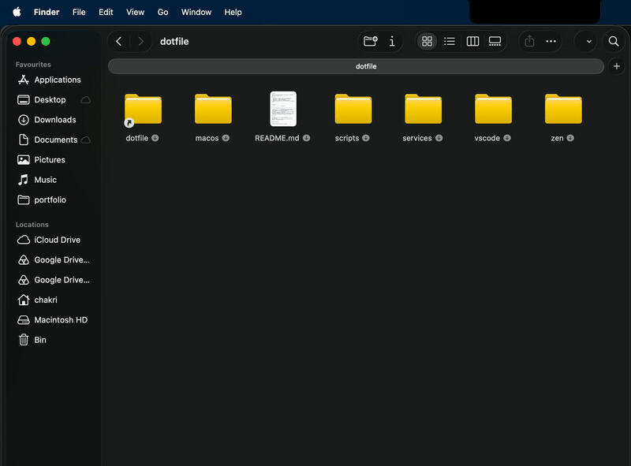
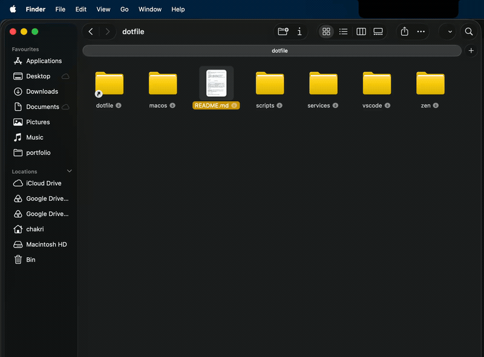
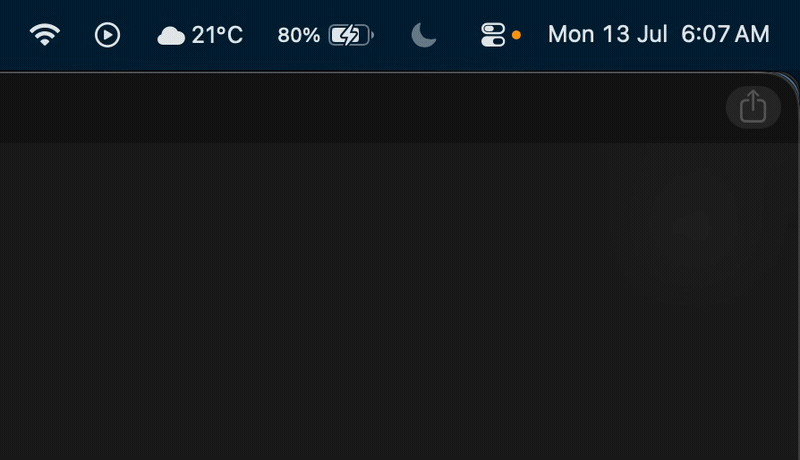
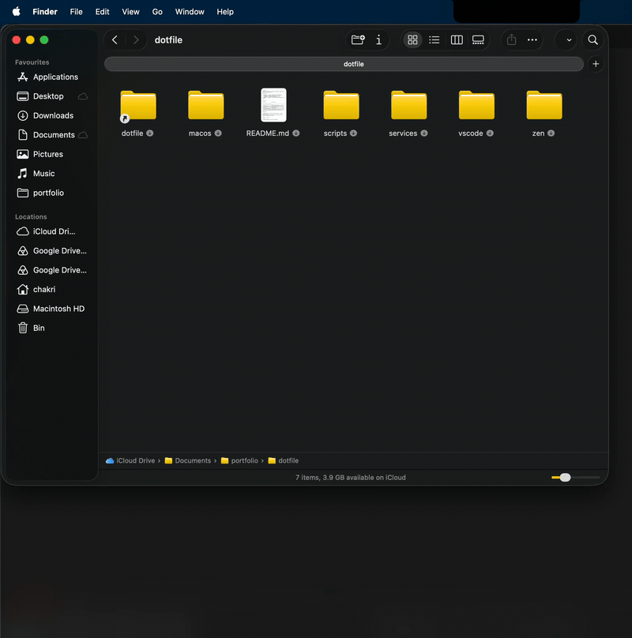

# dotfiles

Personal macOS scripts, configs, and automation. Tested on M4 MacBook Air (Apple Silicon).

## contents

- **scripts/** — `clean`, `netinfo`, `git-clean-branches`
- **macos/** — LaunchAgents and Automator workflows
- **services/** — Finder Quick Actions
- **vscode/** — settings and recommended extensions
- **nvim/** — modular Neovim config (native LSP, Treesitter, lazy.nvim)
- **zen/** — Zen Browser `user.js`, chrome CSS, and theme store exports

---

## scripts

| script               | description                                                                                    |
| -------------------- | ------------------------------------------------------------------------------------------------ |
| `clean`               | updates brew/mas/npm/pip, purges caches (system, VS Code, Zen, Xcode DerivedData), clears logs/trash, flushes DNS, reports space freed |
| `netinfo`             | prints local IP, public IP, gateway, DNS servers, and current Wi-Fi network                     |
| `git-clean-branches`  | scans one level deep for git repos and deletes local branches merged into `main`/`master` or with a gone remote-tracking branch; defaults to preview mode |
| `repo-sync`          | scans one level deep for git repos in a base folder (default `~/Documents/portfolio`) and fast-forward pulls (`--ff-only`) any that are behind origin; repos that are ahead, diverged, or have no upstream are flagged and skipped instead of touched |

### install

```zsh
git clone https://github.com/chakri192/dotfile ~/Documents/portfolio/dotfile
cd ~/Documents/portfolio/dotfile
chmod +x scripts/clean scripts/netinfo scripts/git-clean-branches scripts/send-to-ollama scripts/repo-sync
```

Add to `~/.zshenv`:

```zsh
export PATH="$HOME/Documents/portfolio/dotfile/scripts:$PATH"
```

### usage

```zsh
clean                        # full system cleanup + updates
netinfo                      # show network info
git-clean-branches           # preview stale branches in repos under cwd
git-clean-branches ~/dev -y  # actually delete them
git-clean-branches ~/dev -y -f  # force-delete even if unmerged
```

### dependencies

- `zsh` — required shell
- `curl` — used by `netinfo` for public IP lookup
- `brew` — Homebrew (optional, skipped by `clean` if missing)
- `mas` — Mac App Store CLI, `brew install mas` (optional)
- `npm`, `pip3` — optional, skipped if not installed
- `sudo` — `clean` needs it for `periodic` maintenance and DNS flush

---

## macos/

### LaunchAgent — Caps Lock remap

`macos/launchagents/com.user.capslock-remap.plist` remaps Caps Lock to Right Command via native `hidutil`, no Karabiner-Elements required.

```zsh
cp macos/launchagents/com.user.capslock-remap.plist ~/Library/LaunchAgents/
launchctl load ~/Library/LaunchAgents/com.user.capslock-remap.plist
```

### Automator — Send to Gmail

`macos/automator/Send to Gmail.workflow` is a Finder Quick Action that drives Mail.app via AppleScript to send selected files as attachments.

```zsh
cp -R "macos/automator/Send to Gmail.workflow" ~/Library/Services/
```

---

## services/

`services/finder-new-item/New Item.workflow` — Finder Quick Action for creating new empty files (à la Windows' "New > Text Document") directly from the right-click menu.

```zsh
cp -R "services/finder-new-item/New Item.workflow" ~/Library/Services/
```

### Send to Ollama

`services/send-to-ollama/Send to Ollama.workflow` — Finder Quick Action that runs selected files through `scripts/send-to-ollama` (local `llama3.1:8b` via Ollama), writing `<name>-summary.md` next to each original.

```zsh
cp -R "services/send-to-ollama/Send to Ollama.workflow" ~/Library/Services/
```

Requires `scripts/send-to-ollama` on `$PATH` (see [scripts install](#install)) and `bat` for content extraction. Depends on `~/Documents/portfolio/dotfile/scripts/send-to-ollama` being at that literal path — the workflow's Run Shell Script step calls it via `$HOME/Documents/portfolio/dotfile/scripts/send-to-ollama`.

---

## VS Code configuration

Optimized settings for Python, JavaScript/TypeScript, C/C++, and web development.

### features

- **Performance** — disabled accessibility/telemetry, smooth scrolling, optimized minimap
- **Typography** — JetBrains Mono with ligatures, 13.5px editor font
- **File management** — smart nesting for related files (`.ts` with `.js`, `.h` with `.c`)
- **Formatting** — Prettier (JS/JSON), Ruff (Python) with format-on-save
- **Quality of life** — bracket colorization, sticky scroll, linked editing, bracket guides
- **Language overrides** — Python (Ruff + imports), Markdown (word wrap, no format), JSON

### setup

```zsh
cp vscode/settings.json ~/Library/Application\ Support/Code/User/settings.json
```

Install extensions — open the folder in VS Code and accept the "Install Recommended Extensions" prompt, or:

```zsh
jq -r '.recommendations[]' vscode/extensions.json | xargs -n1 code --install-extension
```

20 total, spanning Python, C/C++, web, git, and AI tooling: `ms-python.python`, `charliermarsh.ruff`, `esbenp.prettier-vscode`, `dbaeumer.vscode-eslint`, `eamodio.gitlens`, `ms-toolsai.jupyter`, `github.copilot-chat`, `google.geminicodeassist`, and more — see `vscode/extensions.json` for the full list.

---

## Neovim configuration

A modular config targeting **Neovim 0.11+**, built on [lazy.nvim](https://github.com/folke/lazy.nvim) with native LSP (`vim.lsp.config`/`vim.lsp.enable`), Treesitter (`main` branch), and [blink.cmp](https://github.com/saghen/blink.cmp) completion.

### layout

| path                                                        | contents                                                              |
| ----------------------------------------------------------- | --------------------------------------------------------------------- |
| `nvim/init.lua`                                             | leader keys, PATH shim for spawned jobs, module loader                |
| `nvim/lua/config/`                                          | `options`, `keymaps`, `autocmds`, lazy bootstrap                      |
| `nvim/lua/plugins/`                                        | one file per concern — lsp, completion, treesitter, telescope, git, ui, editor, dap, linting, extras |
| `nvim/stylua.toml` · `nvim/ruff.toml` · `nvim/clang-format` | shared formatter/linter configs referenced by conform + ruff          |

### features

- **LSP** — native, no lspconfig framework; pyright, ruff, clangd, lua_ls, bashls, ts_ls, rust_analyzer, gopls, jsonls, yamlls, taplo, marksman, html, cssls via [mason](https://github.com/mason-org/mason.nvim)
- **Completion** — blink.cmp with LSP, snippets, path, buffer, and lazydev sources
- **Syntax** — Treesitter `main` branch: highlight, indent, folds, sticky context, textobjects
- **Fuzzy find** — Telescope + fzf-native
- **Git** — gitsigns for hunks, Neogit + diffview for per-file staging and commits
- **Format** — conform on save (stylua, ruff, clang-format, shfmt, prettier, rustfmt, goimports, taplo)
- **Lint** — ruff + clang-tidy, plus nvim-lint (shellcheck, yamllint, markdownlint, hadolint)
- **Debug** — nvim-dap + dap-ui (Python via debugpy, C/C++/Rust via codelldb)
- **QoL** — flash motions, oil, todo-comments, render-markdown, which-key, trouble, toggleterm, tokyonight

### install

```zsh
# back up any existing config first
[ -e ~/.config/nvim ] && mv ~/.config/nvim ~/.config/nvim.bak
ln -s ~/Documents/portfolio/dotfile/nvim ~/.config/nvim
nvim   # lazy.nvim bootstraps and installs the plugins on first launch
```

Then, inside nvim, install the external tool binaries via mason:

```
:MasonInstall prettierd shfmt stylua taplo goimports yamlfmt \
  shellcheck markdownlint-cli2 yamllint hadolint debugpy codelldb
```

### dependencies

- **neovim ≥ 0.11** — required for the native LSP API
- **tree-sitter CLI** — `brew install tree-sitter`; the Treesitter `main` branch shells out to it to compile parsers
- **ripgrep** — Telescope live-grep and `:grep`
- **a C compiler** — clang/gcc, for building parsers
- **a Nerd Font** — icons in the statusline, file tree, and completion menu
- per-language toolchains (`go`, `cargo`, `node`) for the matching servers and formatters

---

## Zen Browser configuration

Performance and privacy tweaks for [Zen Browser](https://zen-browser.app), tuned for Apple Silicon.

### files

| file                   | location in profile | description                                       |
| ---------------------- | -------------------- | -------------------------------------------------- |
| `zen/user.js`          | `<profile>/`          | `about:config` overrides applied on every launch  |
| `zen/userChrome.css`   | `<profile>/chrome/`   | browser UI customization                          |
| `zen/userContent.css`  | `<profile>/chrome/`   | webpage-level style overrides                     |
| `zen/zen-themes.css`   | `<profile>/chrome/`   | Zen-specific theme overrides                      |
| `zen/zen-themes/`      | `<profile>/chrome/zen-themes/` | exported Zen Theme Store themes (per-theme `chrome.css`, some with `preferences.json`) |

### what user.js covers

- **Performance** — WebRender/Metal compositor, 60fps frame rate, HTTP/3, DNS prefetch, larger disk/memory cache
- **Memory** — incremental GC, background tab unloading after 3 min, reduced session I/O
- **Privacy** — social/fingerprint/cryptomining tracking blocked, all Mozilla telemetry disabled
- **Apple Silicon** — Metal GPU API, hardware video decode, async APZ scrolling, zero paint delay

### install

```zsh
# Find your profile folder: open Zen → about:support → Profile Folder
PROFILE="$HOME/Library/Application Support/zen/Profiles/<your-profile>"

cp zen/user.js "$PROFILE/"
cp zen/userChrome.css zen/userContent.css zen/zen-themes.css "$PROFILE/chrome/"
cp -R zen/zen-themes "$PROFILE/chrome/"
```

Restart Zen — `user.js` values apply on every launch and override `prefs.js`.

> To permanently apply a setting without `user.js`, set it in `about:config` directly.

---

## demos

| Quick Action    | Demo |
| --------------- | ---- |
| New Item        |  |
| Send to Gmail   |   |
| Send to Ollama  |  |

---

## environment

macOS (Apple Silicon) · zsh · VS Code · Zen Browser · tested on M4 MacBook Air

### AI tooling
Documentation assisted by local LLMs via [Ollama](https://ollama.com):
| model              | used for                              |
| ------------------ | ------------------------------------- |
| `qwen2.5-coder:7b` | code suggestions, refactoring         |
| `llama3.1:8b`      | prose, documentation, commit messages |
<!-- Pull Shark Test 1 -->


<!-- Force Shark Badge -->
