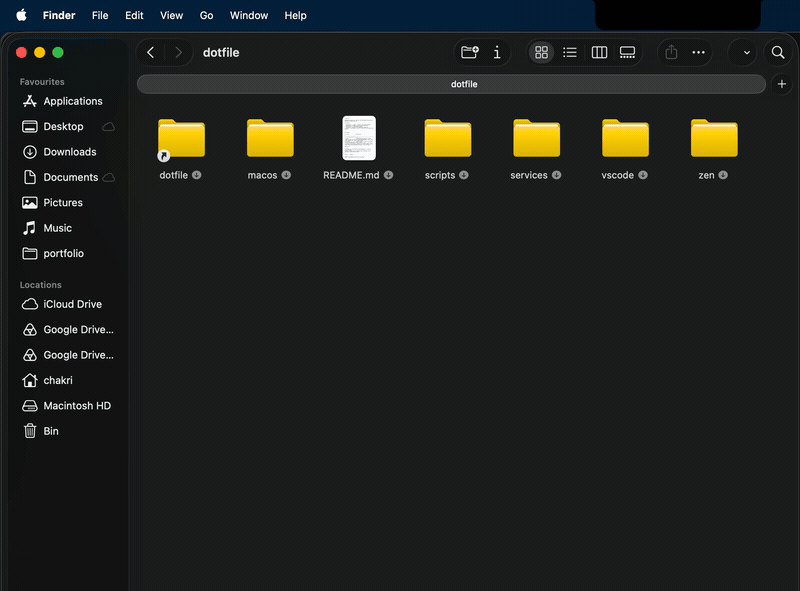
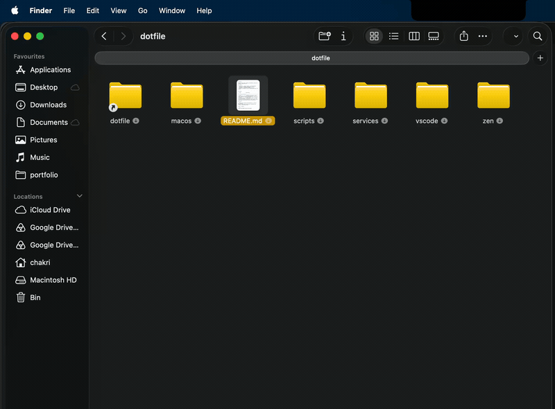
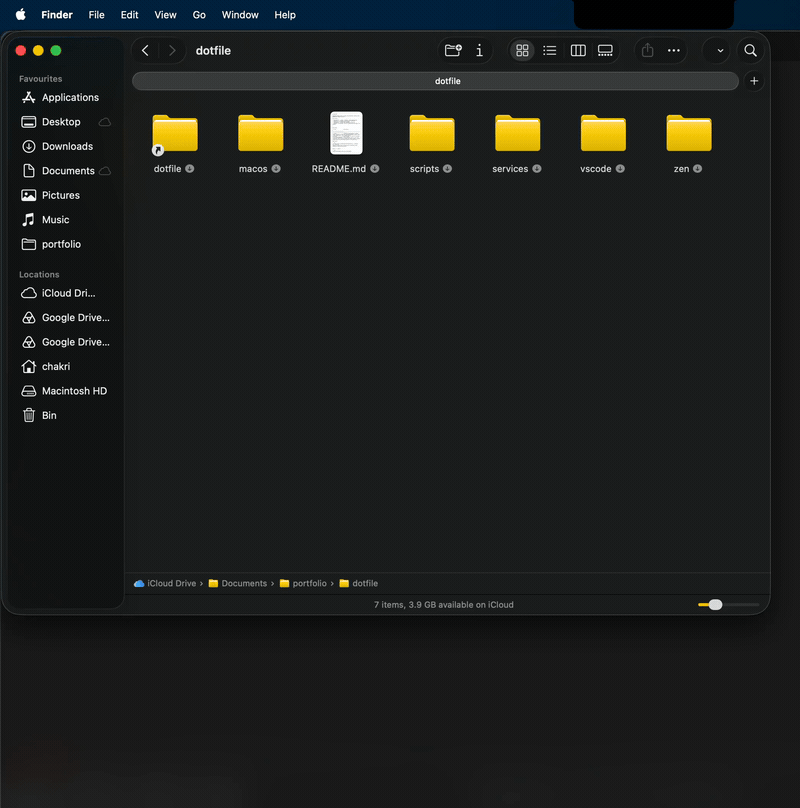

# dotfiles

My macOS setup: zsh, Ghostty, Neovim, tmux, git, SSH, VS Code, Zen Browser, and a few handy scripts.

## Install

Clone it to `~/Documents/portfolio/dotfile`. It works from anywhere, but `repo-sync` and the Send to Ollama quick action expect that path:

```zsh
git clone https://github.com/chakri192/dotfile ~/Documents/portfolio/dotfile
cd ~/Documents/portfolio/dotfile
./install.sh --dry-run      # see what it will do
./install.sh
```

This installs the apps in the `Brewfile`, links the config files into place with GNU Stow, sets up VS Code, and adds the Finder quick actions and the Caps Lock remap.

A few things need doing by hand afterwards (the installer lists them):

```zsh
cp zsh/secrets.zsh.example ~/.secrets.zsh && chmod 600 ~/.secrets.zsh   # your API keys
cp ssh/.ssh/config.local.example ~/.ssh/config.local                   # your SSH hosts
nvim                                                                   # installs plugins on first launch
doctor                                                                 # checks everything is set up
```

## What's included

| Folder | |
|---|---|
| `zsh/` | Shell config: aliases, key bindings, plugins (autosuggestions, history search, vi mode), and a Starship prompt |
| `ghostty/` | Terminal settings: JetBrains Mono, black background, bright colours |
| `nvim/` | Neovim setup (see below) |
| `tmux/` | Prefix `Ctrl-a`, mouse support, vi copy mode |
| `git/` | delta for diffs, useful aliases, a global ignore file |
| `ssh/` | Sensible defaults; your own hosts go in `~/.ssh/config.local` |
| `atuin/`, `nushell/` | Shell history and an alternative shell |
| `vscode/` | Settings and 20 extensions |
| `zen/` | Zen Browser speed, privacy, and theme settings |
| `macos/`, `services/` | Caps Lock → Command, and Finder quick actions |

## Scripts

These are available in the terminal after install.

| Command | |
|---|---|
| `clean` | Update Homebrew and other package managers, clear caches and the Trash, and show how much space was freed. `--dry-run` to preview |
| `netinfo` | Local and public IP, router, DNS, and Wi-Fi network |
| `doctor` | Check that everything is installed and linked correctly |
| `repo-sync` | Pull the latest changes for every repo in `~/Documents/portfolio` |
| `git-clean-branches` | Delete old merged branches in your repos. Shows them first; add `-y` to delete |
| `dotfiles-sync` | Copy changed VS Code and Zen settings back into this repo. Add `-y` to commit and push |
| `macos-defaults` | Apply my Finder, Dock, trackpad, and screenshot settings. `--dry-run` to preview |
| `send-to-ollama` | Summarise files with a local AI model |

## Finder quick actions

Right-click files in Finder → Quick Actions:

| Action | |
|---|---|
| New Item | Create an empty file in the current folder |
| Send to Gmail | Attach the selected files to a new email |
| Send to Ollama | Summarise the selected files with a local AI model |

| New Item | Send to Gmail | Send to Ollama |
|---|---|---|
|  |  |  |

## Neovim

Needs Neovim 0.11+, `tree-sitter`, ripgrep, and a Nerd Font (all in the `Brewfile`).

- Language support for Python, C/C++, Rust, Go, JavaScript/TypeScript, Lua, Bash, JSON, YAML, TOML, Markdown, HTML, and CSS
- Autocomplete, formatting on save, and linting
- File search with Telescope
- Git: gitsigns, Neogit, diffview
- Debugging for Python, C/C++, and Rust
- Tokyo Night theme

After the first launch, install the formatters and linters:

```vim
:MasonInstall prettierd shfmt stylua taplo goimports yamlfmt shellcheck markdownlint-cli2 yamllint hadolint debugpy codelldb
```

## Zen Browser

Find your profile folder in Zen at `about:support` → Profile Folder, then:

```zsh
PROFILE="$HOME/Library/Application Support/zen/Profiles/<your-profile>"
cp zen/user.js "$PROFILE/"
mkdir -p "$PROFILE/chrome"
cp zen/userChrome.css zen/userContent.css zen/zen-themes.css "$PROFILE/chrome/"
cp -R zen/zen-themes "$PROFILE/chrome/"
```

Restart Zen.

## Credits

The zsh setup started from [radleylewis/zsh](https://github.com/radleylewis/zsh).

## License

[MIT](LICENSE) © V Chakradhar

## Contributors

| | |
|---|---|
| [chakri192](https://github.com/chakri192) | Author |
| [aider](https://github.com/Aider-AI/aider) | AI pair programmer |
